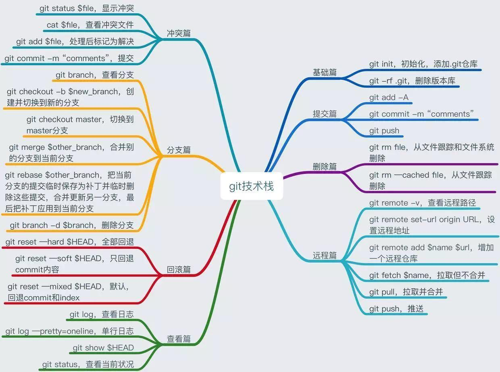

这份笔记整理的资料大部分来自廖雪峰老师的[Git教程](http://www.liaoxuefeng.com/wiki/0013739516305929606dd18361248578c67b8067c8c017b000)

* [Git](#Git)
	* [Git介绍](#Git介绍)
	* [Git工作过程](#Git工作过程)
	* [版本回退、撤销删除、删除文件](#版本回退、撤销删除、删除文件)
		* [版本回退](#版本回退)
		* [撤销删除](#撤销删除)
		* [删除文件](#删除文件)
	* [分支管理](#分支管理)
		* [创建、合并、删除分支](#创建、合并、删除分支)
		* [解决冲突](#解决冲突)
		* [分支管理策略](#分支管理策略)
		* [Bug分支和Feature分支](#Bug分支和Feature分支)
	* [标签管理](#标签管理)
		* [创建标签和操作标签](#创建标签和操作标签)
* [Github](#Github)
	* [远程仓库](#远程仓库)
		* [推送至远程库](#推送至远程库)
		* [添加远程库](#添加远程库)
		* [克隆远程库](#克隆远程库)
* [Git常用命令](#Git常用命令)


<div id="Git"></div>

# Git

<br />

<div id="Git介绍"></div>

## Git介绍

Git是一个**分布式版本控制系统**，最初目的是为更好地管理Linux内核开发而设计  
Git和其他**集中式版本控制系统**不一样，不需要服务器端软件，就可以运作版本控制，**速度快得多**，每个人的电脑上都是一个完整的版本库，直接在本机上获取数据，不必连接到主机端获取数据  
**Git还有强大的分支合并管理功能**  

<br />

<div id="Git工作过程"></div>

## Git工作过程
**工作区（Working Directory）**：就是你在电脑里能看到的目录  
**版本库（Repository）**：工作区有一个隐藏目录.git，这个不算工作区，而是Git的版本库  
Git的版本库里存了很多东西，其中最重要的就是称为**stage（或者叫index）的暂存区**，还有Git为我们自动创建的第一个**分支**`master`，以及指向master的一个**指针**叫`HEAD`  


将文件往Git版本库添加时分为两步:  
**第一步是用**`git add`把文件**添加**进去，实际上就是把**文件修改添加到暂存区**  
**第二步是用**`git commit`**提交更改**，实际上就是把**暂存区的所有内容提交到当前分支**  
**每次的修改必须先**`add`**到暂存区再**`commit`**提交到分支，每次提交只会将在暂存区的修改提交到分支**  

<br />

<div id="版本回退、撤销删除、删除文件"></div>

## 版本回退、撤销删除、删除文件

<br />

<div id="版本回退"></div>

### 版本回退

在Git中可以用`git log`查看提交历史纪录，会看到`commit id`是一大串十六进制的数字  
在Git中，用`HEAD`表示当前版本，`HEAD^`是上一版本，`HEAD^^`是上上一版本，也可以写成`HEAD~2`  
版本回退可以使用`git reset`命令：
```
$ git reset --hard HEAD^
HEAD is now at c2e5a67 add justtest.txt
```

<br />

**注意回到过去版本后历史纪录中未来版本会消失，如果要回到未来版本可以用版本号**`commit id`  
版本号不用写全，只用前几位，Git会自动搜索，但也不能太短，导致查找多个版本号  
```
$ git reset --hard 0e7dd65
HEAD is now at 0e7dd65 add test.txt
```

<br />

<div id="撤销删除"></div>

### 撤销删除

可以用`git checkout -- file`丢弃工作区的修改  
```
$ git checkout -- readme.txt
```
- **如果**`readme.txt`**修改后没有放到暂存区，现在，撤销修改就回到和版本库一模一样的状态**
- **如果**`readme.txt`**已经添加到暂存区后，又作了修改，现在，撤销修改就回到添加到暂存区后的状态**

**总之，就是让这个文件回到最近一次git commit或git add时的状态**

也可以用`git reset HEAD file`命令可以把暂存区的修改撤销掉（unstage），重新放回工作区
```
$ git reset HEAD readme.txt
Unstaged changes after reset:
M       readme.txt
```
`git reset`**命令既可以回退版本，也可以把暂存区的修改回退到工作区**
回退到工作区后再丢弃工作区修改就彻底撤销修改了  
如果提交到版本库就用版本回退，不过前提是没有推送到远程库  

<br />

<div id="删除文件"></div>

### 删除文件

要删除版本库文件，先将工作区对应文件删除，再用`git rm file`删除，并用`git commit`提交  
```
$ git rm test.txt
rm 'test.txt'
$ git commit -m "remove test.txt"
[master 69cd8cc] remove test.txt
 1 file changed, 0 insertions(+), 0 deletions(-)
 delete mode 100644 test.txt
```

<br />

如果误删文件也可以用`git checkout`命令恢复到**最新版本**
```
$ git checkout -- test.txt
```
`git checkout`**其实是用版本库里的版本替换工作区的版本，无论工作区是修改还是删除，都可以“一键还原”**

<br />

<div id="分支管理"></div>

## 分支管理

在新建版本库的时候都会有一条默认的分支`master`，可以在原分支新建一条互不干扰的分支，也可以进行分支合并  
详细的分支和HEAD指针图解可以参阅[分支图解(廖雪峰老师)](http://www.liaoxuefeng.com/wiki/0013739516305929606dd18361248578c67b8067c8c017b000/001375840038939c291467cc7c747b1810aab2fb8863508000)  

<br />

<div id="创建、合并、删除分支"></div>

### 创建、合并、删除分支

用`git checkout -b`可以创建并切换分支，也可以用`git branch`创建再用`git checkout`切换  
```
$ git checkout -b dev
Switched to a new branch 'dev'
```

<br />

直接使用`git branch`可以查看所有分支，当前分支前面带有`*`号
```
$ git branch
* dev
  master
```

<br />

可以用`git merge`命令来合并分支到当前分支  
**如果在合并的过程要提交新的commit，需要加上**`-m`**参数和commit的描述**  
```
$ git merge dev
Updating 69cd8cc..e6f4910
Fast-forward
 test.txt | 0
 1 file changed, 0 insertions(+), 0 deletions(-)
 create mode 100644 test.txt
```

<br />

合并后就可以删除分支了，删除分支用`git branch -d`命令
```
$ git branch -d dev
Deleted branch dev (was e6f4910).
```

<br />

<div id="解决冲突"></div>

### 解决冲突

当两个分支都有修改，在合并的时候就有可能会产生冲突  
```
$ git merge dev
Auto-merging test.txt
CONFLICT (content): Merge conflict in test.txt
Automatic merge failed; fix conflicts and then commit the result.
```

<br />

可以用`git status`查看冲突的内容，手动修改后添加提交后即可解决冲突  
用`git log --graph`可以查看分支的合并情况  

<br />

<div id="分支管理策略"></div>

### 分支管理策略

在通常情况下Git会用`Fast forward`模式，但这种模式下，删除分支后，会丢掉分支信息  
如果需要保留历史纪录可以强制禁用`Fast forward`模式，Git就会在merge时生成一个新的commit  
在合并时加上`--no-ff`参数，`git merge --no-ff`命令，由于合并要创建一个新的commit，所以加上`-m`参数，把commit描述写进去  

<br />

<div id="Bug分支和Feature分支"></div>

### Bug分支和Feature分支

在开发时往往需要修复bug和添加新功能，这时候往往都是**新建分支**，在新分支上工作，完成再合并，删除新分支  
如果在其他分支还没完成提交的话可以用`git stash`将当前工作现场“储藏”起来，可以用`git stash list`查看当前分支stash内容，恢复用`git stash apply`，在恢复后用`git shash drop`删除，或者直接用`git stash pop`恢复并删除  
分支没有被合并时需要删除时，需要强制删除`git branch -D`命令  

<br />

<div id="标签管理"></div>

## 标签管理

在Git中可以为版本库的修改提交打上标签，方便查找并取出历史版本，标签虽然是版本库的快照，但其实它就是指向某个**commit的指针**  

<br />

<div id="创建标签和操作标签"></div>

### 创建标签和操作标签

`git tag <name>`可以为当前分支的最新一次提交打上标签，也可以在后面加上`commit id`为某次提交打上标签，可以加上参数`-a`指定标签名，`-m`指定说明文字  
```
$ git tag -a v0.1 -m "version 0.1 released" 3628164
```

<br />

`git tag`命令可以查看所有标签  
`git show <tagname>`可以查看某个标签的信息和说明  
`git tag -d <tagname>` 可以删除某个标签

<br />

<div id="Github"></div>

# Github

**Github是一个提供Git仓库托管服务的网站**  

<br />

<div id="远程仓库"></div>

## 远程仓库

Git各个工作区之间的关系：  


由于你的本地Git仓库和GitHub仓库之间的传输是通过**SSH加密**的，所以要先设置账户和本地的**SSH Key**，是为了识别出你推送的提交确实是你推送的，具体设置方法可以直接搜索  

<br />

<div id="添加远程库"></div>

### 添加远程库

首先要在Github上创建一个仓库，在将本地库与远程库关联
```
$ git remote add origin git@github.com:username/xxxx.git
```
`origin`**是远程库的名字**，这是Git默认的叫法，`username`表示用户名后面跟的是对应的Github仓库名称
然后将本地库内容推送至远程库使用`git push -u origin master`**第一次推送要加上**`-u`**的参数**，之后推送直接用`git push origin master`

<br />

<div id="推送至远程库"></div>

### 推送至远程库

将本地库内容推送至远程库使用`git push -u origin master`**第一次推送要加上**`-u`**的参数**，之后推送直接用`git push origin master`  
**master也可以换成其他分支**  
```
$ git push -u origin master

$ git push origin master
```

<br />

<div id="克隆远程库"></div>

### 克隆远程库

在对应的目录下，执行下面命令
```
$ git clone git@github.com:username/xxxxxx.git
```
`username`表示用户名后面跟的是对应的Github仓库名称

<br />

<div id="Git常用命令"></div>

# Git常用命令


