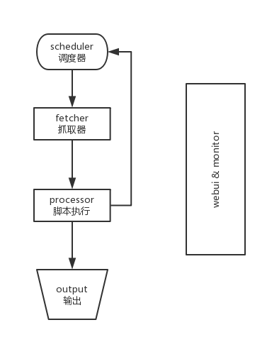
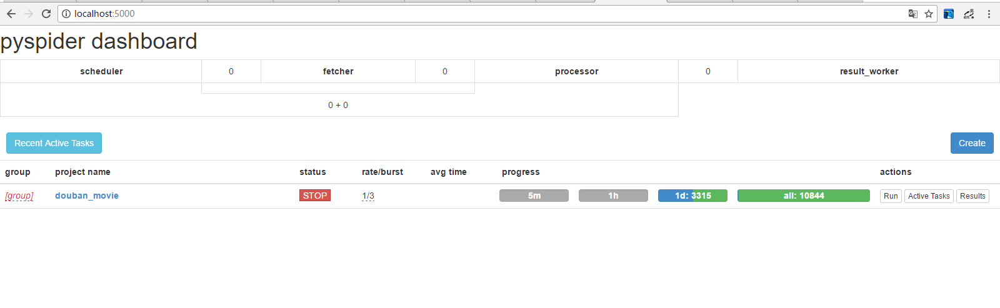
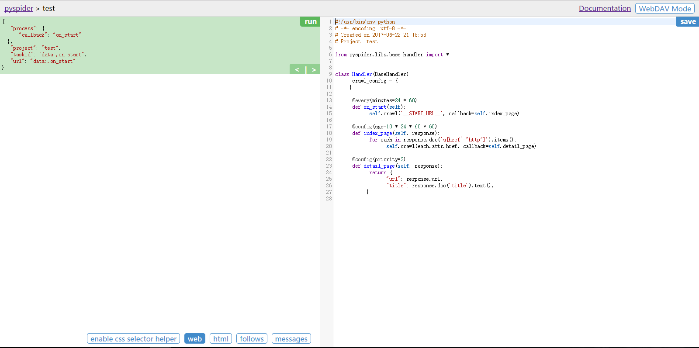

* [pyspider](#pyspider)
	* [安装](#安装)
	* [编写脚本](#编写脚本)
		* [self_crawl](#self_crawl)
			* [参数](#参数)
	* [Response对象](#Response对象)
		* [Response对象的方法及成员](#Response对象的方法及成员)
	* [on_start](#on_start)
	* [index_page和detail_page](#index_page和detail_page)
	* [on_result](#index_page和detail_page)
	* [输出到数据库](#输出到数据库)


<div id="pyspider"></div>

# pyspider

[pyspider](https://github.com/binux/pyspider)是Binux做的一个爬虫架构的开源化实现，主要功能有  
 - 抓取、更新调度多站点的特定的页面
 - 需要对页面进行结构化信息提取
 - 灵活可扩展，稳定可监控

pyspider以**去重调度，队列抓取，异常处理，监控等功能作为框架**，**只需提供给抓取脚本**，并保证灵活性。最后加上**web的编辑调试环境，以及web任务监控**，即成为了这套框架  
pyspider的设计基础是：**以python脚本驱动的抓取环模型爬虫**  

 - 各个组件间使用**消息队列连接**，除了**scheduler是单点的**，**fetcher 和 processor 都是可以多实例分布式部署的**。 scheduler 负责整体的调度控制
 - **任务由 scheduler 发起调度，fetcher 抓取网页内容， processor 执行预先编写的python脚本，输出结果或产生新的提链任务（发往 scheduler），形成闭环**
 - 每个脚本可以灵活使用各种python库对页面进行解析，**使用框架API控制下一步抓取动作，通过设置回调控制解析动作**

<br />

<div id="安装"></div>

## 安装

安装pyspider就和安装其他第三方库一样，也可以用`pip`安装  
**不过注意window64位系统下的64位python不兼容，需要换成32位python**  

<br />

<div id="编写脚本"></div>

## 编写脚本

在安装完用在命令行运行`pyspider all`，再用浏览器打开[http://localhost:5000/](http://localhost:5000/)就可以进入webui界面  
**在对应命令行运行的位置会生成data文件夹保存编写的代码**  

在webui界面可以新建和管理项目，还可以**设置项目状态，设置rate(每秒执行多少个请求)，设置burst(并发数)，运行项目，查看项目的运行情况，查看结果**  
**删除项目只需把group设置成delete并把项目状态设置成STOP，24小时后系统会自动删除此项目**  
新建项目或者进入已有项目即可进入项目编写界面  
编写代码点run可以运行代码  

 - enble css selector helper可以在web界面上选取项目得到对应css选择器语句，**不过有时候不够准确**  
 - web可以看到当前url的页面
 - html可以看到页面html的代码
 - follows可以看到所生成新的请求点击运行键，可以执行对应请求
 - messages有爬取过程中输出的一些信息

在crawl_config中可以设置全局参数，如**代理，headers，itag(设置新的后可以使所有任务都重新执行，需要点run按钮来启动任务)等参数**  
```python
crawl_config = {
        "proxy":"172.16.2.2:3128",
        "headers":{
            "Proxy-Connection": "keep-alive",
            "Pragma": "no-cache",
            "Cache-Control": "no-cache",
            "User-Agent": "Mozilla/5.0 (Windows NT 6.3; WOW64) AppleWebKit/537.36 (KHTML, like Gecko) Chrome/52.0.2743.116 Safari/537.36",
            "Accept": "*/*",
            "DNT": "1",
            "Accept-Encoding": "gzip, deflate, sdch",
            "Accept-Language": "zh-CN,zh;q=0.8,en-US;q=0.6,en;q=0.4",
        }
       "itag": "v223"
    }
```

<br />

<div id="self_crawl"></div>

### self_crawl

self_crawl是pyspider系统中是非常重要的接口，它的功能是告诉pyspider哪些URL需要抓取  

<br />

<div id="参数"></div>

#### 参数

url : 需要被抓取的url或url列表  
callback : 这个参数用来指定爬取内容后需要哪个方法来处理内容，将爬取内容生成Response对象传至对应回调函数  
```python
def on_start(self):
    self.crawl('http://scrapy.org/', callback=self.index_page)
```

<br />

**@every(minutes=0, seconds=0)**
可以在设置多少分钟或秒运行一次此方法,常用来定时执行任务  
实例是这个URL每24小时被执行一次，**注意:如果age设置的时间还没过期或有period设置的比较长,这个url是不会被重新运行抓取**  
```python
@every(minutes=24 * 60)
def on_start(self): for url in urllist:
    self.crawl(url, callback=self.index_page)
```

<br />

**@config(\*\*kwargs)**
可以在回调函数前设置默认函数里`self.crawl()`参数前设置默认参数，如age，priority等参数  
```python
	@config(age=10 * 24 * 60 * 60)
	def index_page(self, response):
    ...

    @config(priority=2)
    def detail_page(self, response)：
    ...
```

<br />

**age** ： 可以设置`@config(age=10 * 24 * 60 * 60)`来指定**任务的有效期，在有效期内不会重复抓取**，默认值是 -1(远不过期，意思是只抓一次)  
这设置的回调index_page的任务有效期是10天，在10天之内再遇到这个任务都会被忽略掉（除非有强制抓取参数才不会忽略）  
```python
self.crawl('https://baidu.com', callback=self.index_page, age=10 * 24 * 60 * 60, validate_cert=False)
```

<br />

**auto_recrawl** ： 设置是否每到age时间重新爬取一次，默认值是：`False`  
**priority** ： 这个参数用来指定**任务的优先级**，数值越大越先被执行，默认值为 0  
**retries** ： 任务执行失败后重试次数，默认值是 3  
**itag** : 任务标记值，此标记会在抓取时对比，如果这个值发生改变，不管有效期有没有到都会重新抓取新内容．多数用来动态判断内容是否修改或强制重爬，默认值是 None  
本实例中使用页面中update-time元素的值当成itag来判断内容是否有更新  
```python
def index_page(self, response):
    for item in response.doc('.item').items():
        self.crawl(item.find('a').attr.url, callback=self.detail_page, itag=item.find('.update-time').text())
```

<br />

**params** ： 把一个字典参数附加到url参数里  
例子里是两个相同任务  
```python
def on_start(self):
    self.crawl('http://httpbin.org/get', callback=self.callback,params={'a': 123, 'b': 'c'})
    self.crawl('http://httpbin.org/get?a=123&b=c', callback=self.callback)
```

<br />

**data** : 这个参数会附加到URL请求的body里，如果是字典会经过form-encoding编码再添加进去  
```python
def on_start(self): 
    self.crawl('http://httpbin.org/post', callback=self.callback,method='POST', data={'a': 123, 'b': 'c'})
```

<br />

**headers** ： 自定义请求头（字典类型）  
**cookies** ： 自定义请求的cookies（字典类型）  
**connect_timeout** ： 指定请求时链接超时时间,单位秒，默认值：20  
**timeout** ： 请求内容里最大等待秒数．默认值：120  
**validate_cert** ： 遇到HTTPS类型的URL时是否验证证书，默认值：True**（遇到HTTPS559证书错误时需要调成False）** 
**proxy** ： 可以设置代理服务器，暂时只支持http代理  
**fetch_type** ： 设置是否启用JavaScript解析引擎. 默认值: `None`  
**js_script** ： 可以输入JavaScript语句在页面上执行一段脚本  
更多参数使用可以查看[官方文档](http://docs.pyspider.org/en/latest/)或者[中文文档](http://www.pyspider.cn/book/pyspider/self.crawl-16.html)  

<br />

<div id="Response对象"></div>

### Response对象

self.crawl()回调函数时，会将URL生成Response对象传到对应函数中去  

<br />

<div id="Response对象的方法及成员"></div>

#### Response对象的方法及成员

**Response.url** ： 返回最后的URL地址  
**Response.text** ： 请求响应的文本格式内容**(如果Response.encoding 是 None 或 chardet 模块可用, 响应内容会自动被解析为指定的编码)**  
**Response.doc ： 本方法会调用PyQuery库用返回的内容生成一个PyQuery对象以方便使用，生成对象时默认已经把里面的所有链接格式化成绝对链接，可直接分析使用(具体使用对象方法可以参考[PyQuery官方参考手册](https://pythonhosted.org/pyquery/))**  
**Response.json** ： 本方法会调用JSON相关库来解析返回的内容  
**Response.status_code** ： 返回响应的状态码  
**Response.headers** ： 请求响应的头信息，dict格式  
**Response.cookies** ： 响应的cookies  
**Response.time** ： 抓取使用的时间  
更多的方法和成员可以参考[官方文档](http://docs.pyspider.org/en/latest/)或者[中文文档](http://www.pyspider.cn/book/pyspider/Response-17.html)  

<br />

<div id="on_start"></div>

### on_start

**on_start函数是pyspider执行脚本时的入口函数**，一般从开始URL开始爬取，回调到其他函数解析，默认是回调到index_page函数  

<br />

<div id="index_page和detail_page"></div>

### index_page和detail_page

index_page和detail_page函数是模板默认生成的两个回调函数，都有参数Response是回调URL得到Response对象，index_page函数一般是是开始URL回调到这个函数解析，detail_page一般是爬取目标页面解析，**并return一个字典到on_result进行输出**  
**当然有更多不同的页面，也可以编写更多回调函数进行解析**  
**作者推荐的解析方法是内置的pyQuery + css选择器，当然也可以用其他第三方库解析**  

<br />

<div id="on_result"></div>

### on_result

on_result是**将结果进行输出的函数**，有参数result就是得到的结果，**可以重写来改变结果输出方式**，默认是将result的内容打印出来  

<br />

<div id="输出到数据库"></div>

## 输出到数据库

要将结果输出到数据库里，需要先写**数据库的接口类，并在代码中导入**，**还要重写on_result的方法来调用接口类**  
对应数据库接口类和on_result函数，可以网上搜索也可以自己编写简单的接口类  
**注意在修改文件后需要重启pyspider才能生效**  

