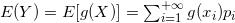
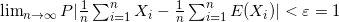

* [概率论(二)](#概率论)
	* [多维随机变量和联合分布函数](#多维随机变量和联合分布函数)
	* [条件分布](#条件分布)
	* [随机变量函数分布](#随机变量函数分布)
	* [数学期望和概率意义](#数学期望和概率意义)
	* [随机变量的方差](#随机变量的方差)
	* [协方差和相关系数](#协方差和相关系数)
	* [依概率收敛和大数定律](#依概率收敛和大数定律)
	* [依分布收敛和中心极限定理](#依分布收敛和中心极限定理)

# 概率论(二)

## 多维随机变量和联合分布函数

在**同一随机实验E**中，称定义在**同一样本空间**上的**n**个随机变量**X1，X2，X3，...，Xn**，称它们构成的有序数组**(X1，X2，X3，...，Xn)为n维随机变量**  
二维随机变量的联合分布函数定义，对任意实数对**(x,y)∈R2**记**{X≤x,Y≤y}**为**(X,Y)**的**联合分布函数**，一维随机变量**X，Y**的分布函数**FX(x)**与**FY(y)**称为(X,Y)的**边缘分布函数**，其中它们的关系为**FX(x)=P{X≤x,Y＜+∞}=limy->+∞F(x,y)**，**FY(x)=P{X＜+∞，Y≤y}=limx->+∞F(x,y)**  
计算时**P{x1＜X≤x2,y1＜Y≤y2}=F(x2,y2)-F(x1,y2)-F(x2,y1)+F(x1,y1)**  
**联合分布函数性质，如果二元函数F(x,y)满足下面性质，则必存在二维随机变量(X,Y)以F(x,y)为分布函数：**  

- 单调不减性，固定一个元，对于另一个元来说单调不减  
- 有界性，**0≤F(x,y)≤1**  
- 右连续性，**F(x,y)**分别关于**x**或**y**为右连续  
- 相容性，对任意**x1＜x2，y1＜y2**，有**F(x2,y2)-F(x1,y2)-F(x2,y1)+F(x1,y1)**  

**n维随机变量联合分布函数**定义和性质也类似**二维随机变量联合分布函数**  
**对于多维随机变量也有离散型和连续型，性质和定义类似一维随机变量**  
**多维随机变量联合分布函数可以求出边缘分布函数，而边缘分布函数不能求出联合分布函数**  
对于一个二维随机变量**(X,Y)**，若对任意实数对**(x,y)**均有**P{X≤x,Y≤y}P{X≤x}P{Y≤y}**成立，则称**X**与**Y**是**相互独立**的，否则称它们是**相依**的，意义是**对任意实数对(x,y)，随机事件对：{X≤x}、{Y≤y}都相互独立**，其等价条件如下：  

- 分布函数形式，**F(x,y)=FX(x)FY(y)**对任意实数对**(x,y)**均成立  
- 分布律形式(离散型随机变量)，**P{X=xi,Y=yj}=P{X=xi}P{Y=yj}**对所有**(xi,yj)**均成立  
- 概率密度形式(连续型随机变量)，**f(x,y)=fx(x)fy(y)**，在平面上除去“面积”为0的集合上成立  

**随机变量的独立性本质是随机事件的独立性**

## 条件分布

对于离散型随机变量的条件分布律，由事件**{Y=yj}**事件发生的条件下，事件**{X=xi}**的条件概率**P{X=xi|Y=yj}=pij/p.j**，i=1，2，...，此概率数列具有分布律的性质，称为在**Y=yj**条件下，随机变量**X**的**条件分布律**，**条件分布函数**为**FX|Y(x|y)=P{X≤x|Y=yj}**  
对于连续型随机变量的**条件分布函数**为**limΔy->0+P{X≤x|y-Δy＜Y≤y}**(**P{y-Δy＜Y≤y}＞0**)极限存在，称此极限函数为在**Y=y**的条件下，随机变量**X**的条件分布函数，记**FX|Y(x|y)**，由此可以推倒出**FX|Y=∫x-∞f(u,y)du/fY(y)**，然后可得条件概率密度为**fX|Y(x|y)=f(x,y)/fY(y)**，(**x为自变量，y为固定值**)  
**在联合分布，边缘分布和条件分布有以下关系**  
  

## 随机变量函数分布

对于离散型随机变量**X**的分布律为**P{X=xi}=pi**，i=1，2，...，**Y=g(X)**是随机变量，则**P{Y=yj}=P{g(X)}=yi}=Σxi∈SjP{X=xi}，j=1，2，...，Sj={xi|g(xi)=yi}**，而对于二维以及多维随机变量也类似  
**离散卷积公式**，设随机变量(X,Y)是离散型随机变量，X，Y相互独立，其分布律分别为**P{X=k}=pk**，k=0，1，2，...，**P{Y=r}=qr**，r=0，1，2，...，则**X+Y**的分布律为  
  
对于连续型随机变量**X**，概率密度为**fx(x)**，若**Y=g(x)**也是连续型随机变量，**FY=P{g(x)≤y}=∫{x|g(x)≤y}f(x)dx**，**fY(y)=F'Y(y)，在fY(y)的连续点**，在**其他点为0**，对于二维以及多维随机变量也类似  
**连续卷积公式**，设随机变量(X,Y)是连续型随机变量，X，Y相互独立，**Z=X+Y**也是随机变量，则有  
  

## 数学期望和概率意义

设**X**是离散型随机变量，其分布律为**P{X=xi}=pi，i=1，2，3...**，若  
  
，则称  
  
对于连续型随机变量**X**的概率密度为**f(x)**，若  
  
，则称  
  
**数学期望是个数**
**对于常见分布的数学期望：**

- 泊松分布**X~P(λ)**，则**E(X)=λ**  
- 二项分布**X~B(n,p)**，则**E(X)=np**  
- 正态分布**X~N(μ，σ2)**，则**E(X)=μ**  
- 均匀分布**X~U(a,b)**，则**E(X)=(b+a)/2**  
- 指数分布**X~E(λ)**，则**E(X)=1/λ**  

设**Y**是随机变量**X**的函数**Y=g(X)**，**g(x)**为连续函数，若**X**是离散型随机变量，分布律为**P{X=xi}=pi，i=1，2，3，...**，如果**g(xi)pi**满足上述离散型随机变量数学期望的条件，则有  
  
若**X**是连续型随机变量，其概率密度为**fX(x)**，若**|g(x)|f(x)**满足上述连续型随机变量数学期望的条件，则有  
  
**就是说可以用X的分布律/概率密度去表示Y的数学期望**  
**数学期望的性质：**

- 线性性，**E(cX+b)=cE(X)+b**
-   
- 若**X1，X2，...，Xn相互独立**，则  

## 随机变量的方差

**方差是刻划随机变量的波动性**，设**X**是随机变量，若**E{[X-E(X)]2}**存在，称**D(X)=E{[X-E(X)]2}**为**X**的方差，**σ(X)=(D(X))1/2**称为**X**的标准差或均方差，对于离散型和连续型随机变量的方差与其数学期望形式类似，分别是下面的式子  
  
  
**方差还可以用数学期望表示D(X)=E(X2)-[E(X)]2**  
**常见分布的方差**  

- 泊松分布**X~P(λ)**，则**E(X)=D(X)=λ**  
- 二项分布**X~B(n,p)**，则**E(X)=np**，**D(X)=np(1-p)**  
- 正态分布**X~N(μ,σ2)**，则**E(X)=μ**，**D(X)=σ2**
- 均匀分布**X~U(a,b)**，则**E(X)=(b+a)/2**，**D(X)=(b-a)2/12**
- 指数分布**X~E(λ)**，则**E(X)=(D(X))1/2=1/λ**

**方差的概率意义**，**方差刻划了随机变量X相对数学期望的偏离程度**  
**由于随机变量X与数学期望值E(X)偏离程度最小，所以方差是随机变量X关于任何值的偏离程度的最小值**  
**方差的性质：**  

- **D(c)=0，D(cX)=c2D(X)**
-   
- **D(X+Y)=D(X)+D(Y)+2E{\[X-E(X)\]\[Y-E()\]}**，**D(X-Y)=D(X)+D(Y)-2E{\[X-E(X)\]\[Y-E()\]}**  
- 设随机变量**X**的**E(X),D(X)**存在，且**D(X)＞0**令**X*=(X-E(X))/D(X)1/2**，有**E(X*)=0，D(X)=1**，称**X***为**X**的标准化随机变量  
- **D(X)=0**，**有P{X=E(X)}=1**  
- **切比雪夫不等式**，若随机变量**X**，方差**D(X)存在，则∀ε>0**使得**P{|X-E(X)|≥ε}≤D(X)/ε2**  

## 协方差和相关系数

**协方差和相关系数就是描述多个随机变量之间相互关系的数字特征**  
协方差定义，若**E{\[X-E(X)\]\[Y-E(Y)\]}**存在，称**Cov(X,Y)=E{\[X-E(X)\]\[Y-E(Y)\]}**为随机变量(X,Y)的协方差，**计算协方差Cov(X,Y)=E(XY)-E(X)E(Y)**  
协方差矩阵为有各个系数的协方差组成，对角线为**D(Xi)**，还是个半正定阵，还有**cij2≤ciicjj**
**协方差性质：**  

- **Cov(X,Y)=Cov(Y,X)**  
- **Cov(aX,bY)=abCov(X,Y)，a,b**为常数  
- **Cov(X1+X2,Y)=Cov(X1,Y)+Cov(X2,Y)**

**相关系数是衡量两个随机变量之间线性相关程度的数字特征**
相关系数定义，设二维随机变量**X，Y**的**D(X)＞0**，**D(Y)＞0**称以下式子为随机变量X与Y的**相关系数**  
  
以及变式  
**矩**定义，设**X**为随机变量，若**E(|X|k)＜+∞**，称**γk=E(Xk)，k=1，2，...**为**X**的**k阶原点矩**，而**αk=E(|X|k)**称为**k阶绝对原点矩**，若**E[|X-E(X)|k]＜+∞**，称**μk=E{[X-E(X)]k} k=1，2，...**为**X**的**k阶中心矩**，称**βk=E[|X-E(X)|k|] k=1，2，...**为**X**的**k阶绝对中心矩**

## 依概率收敛和大数定律

**依概率收敛**的定义，设**{Xn}**是一个随机变量序列，**X**是一个随机变量或常数，若对任意**ε＞0**，有**limn->∞P{|Xn-X|≥ε}=0**，则称随机变量序列**{Xn}**依概率收敛于**X**  
**大数定律**定义，设**Xn，n=1，2，...**是随机变量序列，其数学期望都存在，若对于任意的**ε＞0**，有下面式子，则称随机变量序列**{Xn}**服从**大数定律**  
  
**大数定律的概率意义，{Xk}，k=1，2，...的前n项算术平均将紧密地聚集在数学期望附近**  
**切比雪夫大数定律**定义，设**Xk，k=1，2，...**是**相互独立**的随机变量序列，其**数学期望和方差都存在**，且存在常数**C**，使得**D(Xk)＜C，k=1，2，...**，即方差**一致有界**，则随机变量序列**{Xk}，k=1，2，...**服从大数定律  
**独立同分布大数定律**，设**X1，X2，...，Xn，...**是**相互独立**的随机变量，且**E(Xi)=μ，D(Xi)=σ2，i=1，2，...，**则  
  

## 依分布收敛和中心极限定理

依分布收敛定义，设**X1，X2，...，Xn，...**是随机变量序列，**X**是随机变量，**Fn(x)**和**F(x)**分别是**Xn**和**X**的分布函数，如果在F(x)的连续点x处均有**limn->∞Fn(x)=F(x)**，则称随机变量序列**X1，X2，...，Xn，...**依分布收敛于**X**，**注意依概率收敛一定有依分布收敛，反之不然**  
**独立同分布中心极限定理**，设{Xk}，k=1，2，...为**相互独立**，具有相同分布的随机变量序列，且**E(Xk)=μ**，**D(Xk)=σ2≠0(k=1,2,...)**则**{Xk}**服从**中心极限定理**，即**{Xk}前n项和的标准化随机变量序列依分布收敛于标准正态分布随机变量**  
  
**当二项分布中n足够大时，二项分布作标准化处理后可以近似地视为标准正态分布(一般n≥30)**  

