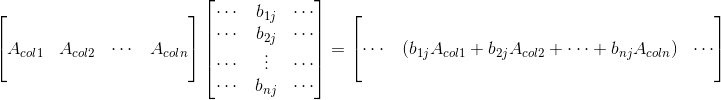
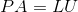
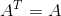

* [线性代数](#线性代数)
	* [矩阵乘法](#矩阵乘法)
	* [置换矩阵（Permutation Matrix）](#置换矩阵)
	* [对称矩阵（Symmetric Matrix）](#对称矩阵)
	* [向量空间（Vector Space）](#向量空间)
	* [子空间（Sub-space）](#子空间)
	* [列空间和零空间](#列空间和零空间)
	* [求解Ax=0](#求解Ax=0)
	* [求解Ax=b](#求解Ax=b)
	* [投影](#投影)
	* [最小二乘法](#最小二乘法)




# 线性代数(一)




## 矩阵乘法

矩阵乘法有五种基本的方法，下面用**AB=C**的例子说明

- **行乘列**：就是根据矩阵乘法的定义来的，第**cik**就是**A**的i行乘**B**的第k列的和  
  
- **整列相乘**：就是利用线性组合的思想，就是将矩阵**B**中的各列看作独立的列向量，再右乘矩阵**A**，**又因为矩阵与向量相乘等价于A中列向量的线性组合**，所以**C**中的第j列是**A**的列向量以**B**第j列为系数所求得线性组合  
  
- **整行相乘**：也是用线性组合的思想，与整列相乘类似，不过这次是用**B**中的行向量与对于**A**中的系数所得线性组合  

- **列乘行**：就是将**A**的对应列和**B**对应行相乘，得到的矩阵相加  

- **分块乘法**：就是先将矩阵分块后，再相乘  





## 置换矩阵（Permutation Matrix）

**置换矩阵是一种系数只由0和1组成的方块矩阵。置换矩阵的每一行和每一列都恰好有一个1，其余的系数都是0，用于矩阵行或列的置换**  

设**P**为置换矩阵， 对任意可逆矩阵**A**有  

**n**阶方阵的置换矩阵**P**有**n!**个  
对置换矩阵**P**有  




## 对称矩阵（Symmetric Matrix）

**对称矩阵是关于主对角线对称的矩阵**  
对称矩阵**S**有  
对任意矩阵**R**有**RTR**为对称矩阵:  





## 向量空间（Vector Space）

**向量空间就是在解析几何里引入向量概念，就是可以由一组向量通过线性组合表示出空间的所有向量**  
向量空间有两大性质  
**所有向量空间都必须包含原点**  
**所有向量空间对空间内的任意向量满足加法和乘法运算封闭**  




## 子空间（Sub-space）

**就是它满足向量空间的规则，又不包含向量空间中所有的向量，就是一个子空间，它有着和向量空间相同的性质**  
**P L分别为向量空间里两个子空间 P ∪ L不是子空间，P ∩ T是子空间**  




## 列空间和零空间

**列空间就是一个矩阵A各个列向量的线性组合得到的空间，记作C(A)**  
**列空间与Ax=b方程组的联系是，当且仅当b属于A的列下空间时Ax=b有解，此时x就是对应的线性组合**  
**零空间就是对方程组Ax=0中x的所有解组成的集合**  




## 求解Ax=0

对于求解Ax=0方程组有以下步骤  
先进行消元得到**阶梯阵U**  
例如矩阵**A**一个3x4的矩阵  
  
可以得到**主元**的个数，即为矩阵秩的**r** = 2  
**主元**所在的列为**主列**，其余列为**自由列**
**主列的个数 = 主元的个数 = 矩阵的秩 = 矩阵转置后主列数**
**自由列**对应的变量为**自由变量**，**自由变量的个数为n - r = 2**  
通常，是给自由变量赋予特殊值(令一个为1，其他为0)，去求出特殊解，如，令，求得特解；再令，求得特解，所有特解的线性组合就是x的解  
  
**这也是Ax=0的零空间，特解为零空间一组基，特解个数为零空间的维数**  

 

还可以将**U**进一步简化，即将**U**矩阵化简为**R**矩阵（Reduced row echelon form），即简化行阶梯形式  
在简化行阶梯形式中，主元上下的元素都是0：  
通过对矩阵**R**的列交换，将主元放在一起，自由变量放在一起，得到  
，**其中I为单位矩阵，F为自由变量组成的矩阵**  
零空间矩阵**N**（nullspace matrix），其列为Ax=0特解，根据**RN=0**  
  
解得，与之前求得特解相同  




## 求解Ax=b

要求解Ax=b方程组时，还要先判断该方程组是否有解  
例如一个3x4得矩阵**A**，先写出其增广矩阵（augmented matrix），再进行消元  
  
**显然，有解的必要条件为b3−b2−b1=0**  
讨论**b**满足什么条件才能让方程**Ax=b**有解：除了上面说的**当且仅当bb属于AA的列空间时**。另一种描述：**如果A的各行线性组合得到0行，则b端分量做同样的线性组合，结果也为0时，方程才有解**  
**解法：令所有自由变量取0**，则有，接得，代入**Ax=b**可得特解  
**Ax=b**又可以拆分成  
**Ax=0的解即为零空间在上面已经讲解求法（称为Ax=b的基础解系）**  
即Ax=b解为其特解加上零空间，对于本例x而言  

 

**矩阵的秩 r 和Ax=b解的个数也有着密切的联系**  
**对于m x n的矩阵而言，r<=min(m,n)**  
**两个矩阵之和的秩不大于两个矩阵秩之和**  

**列满秩 r=n < m 自由变量有0个，零空间只有零向量，如果有解=只有唯一解（有0或1个解）**  
**行满秩 r=m 消元后没有零行Ax=b对任意b都有解，有r个主变量，n-r（n-m）个自由变量  （无穷多个解）**  
**r < n，r < m 不一定有解，有解的话有无穷多个解（0或无穷多个解）**  
**行列满秩 r=m=n 可以得到一个可逆矩阵，A最终可以化简为R=I，其零空间只包含0向量，对任意的b有唯一解（1个解）**  




## 投影

在讲投影前，先要了解下向量**正交**  
**正交在二维空间中就是垂直，就是两向量内积为0，(α,β)=a1b1+a2b2+...+anbn**  
**有(α,β) = αβT，(α,β) = (β,α)**，这是正交两个简单的性质  

 

**首先先要说下为什么需要投影，对于Ax=b有些时候是无解，只能求的最接近的解，因为b不一定在A的列空间中，所以要找到最接近的解，就是找到b在A列空间中的投影，将Ax=b传换成Ax'=p，x'就是求的最接近的解**  
先从二维空间的投影开始讲起  
  
由图上可以看出，误差向量**e = b - p**，**e**⊥**p**，**p**在**a**上，所以**p**可以表示为**p = x a**，**aTe=aT(b-p)=aT(b-ax)=0**，可以推出  
  
  
**从上面的式子可以看出，如果将b变为2b则p也会翻倍，如果将a变为2a则p不变**  
**设有一个矩阵P，若该矩阵与某个向量作用后，得到其投影向量，那么这个矩阵就是投影矩阵**  
可以容易的看出(因为a是个向量，**aTa**是一个常数)，若**a**是n维列向量，则**P**是一个n×n矩阵  
投影矩阵有两个明显的性质  
**P = PT**，投影矩阵是一个对称矩阵  
**P2 = P**，这个由几何的角度和代数角度都不难推出  
上面是二维空间中的，那么也可以下面看看多维空间中的  
在**R3**中，将向量**b**投影在平面**Q**上，设平面**Q**上的与一组基为**a1，a2**，可以写成**Ax'=p**，**A**由**a1，a2**组成  
对于向量**e**，有**e = b - Ax'**，使它垂直于平面，因此可以得到两个方程，写成矩阵形式，即**AT(b-Ax') = 0**，可以得出向量**e**在**A**的左零空间中，根据四大子空间的关系，左零空间⊥列空间，所以**e**⊥**C(A)**  
再化简方程，可以得到**ATAx' = ATb**  
**可以得到三个公式**  
  
  
  
**而在二维中P的两大性质，易证得在此也适用**  




## 最小二乘法

在讲最小二乘前在说下投影，向量**b**投影后，有**b=e+p**,**p=Pb**,**e=(I−P)b**，这里的**p**是**b**在**C(A)**中的分量，而**e**是**b**在**N(AT)**中的分量  
**最小二乘法拟合直线**就是投影应用经典案例  
假设有三点(1,1),(2,2),(3,2)，需要找出偏差最小的直线y=C+Dt  
  
根据条件可以得出方程组，写作矩阵形式，也就是**Ax=b**，很明显这方程无解  
最小二乘法就是要使他们的误差**e**的平方和最小，**e12+e22+e32最小**，**e** = **Ax-b**，假设**Ax'=p**为最优解，可以根据**A1TAx'=A1Tb**(核心方程)解出**x'**  
  
得到方程组，这个方程组称为**正规方程组**  
而在之前的式子，要求最小值，要先对**C**和**D**分别求偏导数，再令求得的偏导式为零即可，得到的方程组就是我们刚得到**正规方程组**  
可以容易解得  
代回直线方程可以解出  
将**p**和**e**写成向量的形式，可以看出**b=p+e**，还有**p·e=0，即p⊥e**，实际上**e**不只垂直投影向量**p**，他同时还垂直于列空间  
**注:上面用到了一个定理，如果A各列线性无关，ATA是可逆矩阵，在此不详细证明**  

