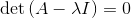
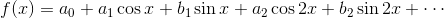
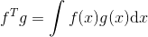
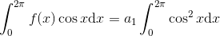
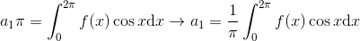
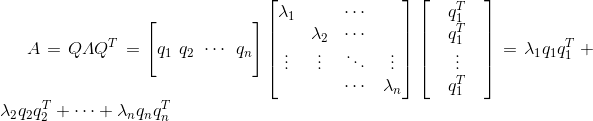

* [线性代数(二)](#线性代数)
	* [特征值和特征向量](#特征值和特征向量)
	* [马尔科夫矩阵（Markov matrix）](#马尔科夫矩阵)
	* [傅里叶级数](#傅里叶级数)
	* [对称矩阵](#对称矩阵)
	* [正定矩阵](#正定矩阵)

# 线性代数(二)

## 特征值和特征向量

**特征向量**：对于矩阵**A**，有**Ax**平行与**x**，这个**x**就是**特征向量**，即满足**Ax=λx**方程的**x**  
**特征值**：**特征值**就是**Ax=λx**中不同特征向量对应的不同的λ(**可以有重复的特征值，也可以是实数或复数**)  
**迹**：矩阵对角线上的元素之和称为矩阵的**迹**，**所有特征值之和等于迹**  

- 特征值为0时，有**Ax=0**，也就是特征向量位于A的零空间，**也就是说，如果矩阵是奇异的(行列式等于0)，就必有一个特征值λ=0**  

- 对于投影矩阵**P=A(ATA)-1AT**的特征值和特征向量，可以知道只有在**A**的列空间中或是垂直与于**A**的列空间的向量才是特征向量，所以投影矩阵的特征值为**λ=1,0**  

要求出矩阵的特征向量和特征值就是求解**Ax=λx**，这个方程有两个未知数，通过移项可得(**A−λI**)**x=0**，而(**A-λI**)必然是个**奇异矩阵**，否则**x**就等于**零向量或零矩阵**，所以有  
  
这个方程叫**特征方程**，求解出特征值再回代就可以得到特征向量  
**关于特征值还有几个性质**  
- **特征值之积等于矩阵的行列式**  
- **三角阵的特征值就是对角线元素**  

## 马尔科夫矩阵（Markov matrix）

**马尔科夫矩阵是指具有以下两个特性的矩阵：**

- 矩阵中的所有元素大于等于0；（因为马尔科夫矩阵与概率有关，而概率是非负的）  
- 每一列的元素之和为1  

**根据上面的两条性质，可以得到两个推论：**

- 马尔科夫矩阵必有特征值为1  
- 其他的特征值的绝对值皆小于1  

具体证明不在此详细说明  

## 傅里叶级数

说傅里叶级数前，再说下投影相关的性质  
设**q1，q2，...qn**是一组**标准正交基**，则向量**v**在该标准正交基上展开为**v=x1q1+x2q2+...+xnqn**，如果想知道某个**xi**，可以左右乘以**qiT**，根据内积定义可以得到**qiTv=xi**  
这是傅里叶级数展开式  
  
傅里叶发现在函数空间中，可以对函数**f(x)**投影在一系列相互正交的函数中，就像向量**v**展开（投影）到向量空间的一组标准正交基中  
函数空间中的**f(x)**就是向量空间中的**v**，函数空间中的**1，cosx，sinx...**就是向量空间中的**q1，q2...qn**，不同的是，**函数空间是无限维**的而向量空间通常是有限维的  
如果要求里面的参数就要先知道**"函数正交"**，和向量内积一样，函数的内积也是每个值之积然后求和，这里函数是连续的，求和就是积分，有  
  
可以简单检验出上面函数之间内积为0，具体求解系数(**a0**是**f(x)**平均值)，例如求解**a1**，和在向量空间中相同，等式两边同时做**cosx的内积**，原式变为，进一步化简可得，可以同样的方法求得所有参数  

## 对称矩阵

**对称矩阵在特征值和特征向量中有着两个特性：**  

- 特征值为实数
- 特征向量相互正交（当特征值重复时，特征向量也可以从子空间中选出相互正交正交的向量）

对于对称矩阵可以得到一组**标准正交的特征向量**，可以将矩阵分解为**A=QΛQ-1**，对于标准正交矩阵，有**QQT=I**，所以矩阵**A**可以分解为**A=QΛQT**  
  
注意这个展开式中的**qqT**，因为**q**是单位列向量所以**qTq=1**，结合之前投影所讲的**qqT/qTq = qqT**是一个投影矩阵  
**实际上每一个对称矩阵都可以分解为一系列相互正交的投影矩阵**  

## 正定矩阵

**正定矩阵就是在对称矩阵的基础上，还有三大性质**：

- 所有主元为正数
- 所有特征值为正
- 子行列式为正

**半正定矩阵就是特征值为非负数的对称矩阵**  
判断正定矩阵的方法：

- 矩阵的所有特征值大于零则矩阵正定：**λ1>0, λ2>0**
- 矩阵的所有顺序主子阵的行列式大于零则矩阵正定：**a>0, ac−b2>0a>0, ac−b2>0**
- 矩阵消元后主元均大于零：**a>0, ac−b2a>0a>0, ac−b2a>0**
- **xTAx>0**

一般情况下第四条是正定矩阵的定义，而前三条可以验证正定矩阵  
正定矩阵的几何意义就是一个椭球，在2阶时是个椭圆，3阶时就是个椭球体，**特征向量说明了主轴的方向，特征量说明了主轴的长度**  

