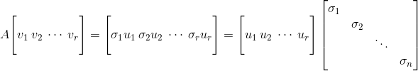
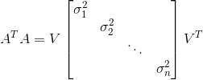
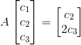
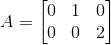
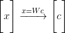
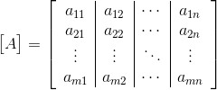
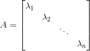
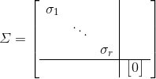
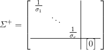

* [线性代数(三)](#线性代数)
	* [奇异值分解（SVD）](#奇异值分解)
	* [线性变换](#线性变换)
	* [基变换](#基变换)
	* [左右逆和伪逆](#左右逆和伪逆)

# 线性代数(三)

## 奇异值分解（SVD）

奇异值分解就是将矩阵分解为**A=UΣVT**的形式，分解的因子分别为正交矩阵、对角矩阵、正交矩阵，此时**U**是m×m正交矩阵，**Σ**是m×n对角矩阵，**VT**是n×n正交矩阵，**而这两个正交矩阵通常是不同的**，**这种分解可以对任意的矩阵使用**  

- 如果是正定矩阵可以分解为**A=QΛQT**，**Q**是一个正交矩阵，所以这就是它的奇异值分解，这时候的两个正交矩阵相同  

我们要做的就是在**A**的**列空间**中找到一组特殊的正交基**v1，v2，...vr**，这组正交基在**A**的线性变换下可以转换**行空间**的一组正交基**u1，u2，...ur**，用矩阵形式表示  
，即**Av1=σ1u1, Av2=σ2u2,⋯,Avr=σrur**，这些**σ**是**缩放因子**(**也称为奇异值**)，表示在转换过程中有拉伸或压缩  
最终可以写成**AV=UΣ**，在进一步到**A=UΣV-1**，因为**V**是标准正交矩阵，所以有**A=UΣVT**  
要求解**A=UΣVT**，可以先消去**U**，消去方法是左乘一个**AT**，可以得到**ATA=VΣTUTUΣVT**由于**U**是标准正交矩阵，所以**UUT=I**，而**ΣTΣ**是对角线元素为**σ2**的对角矩阵，所以有  
  
这个式子中**V**即是**ATA**的**特征向量矩阵**而**Σ2**是其**特征值矩阵**，**将特征向量标准化后就是对应的v**
同理，我们只想求**U**时，用**AAT**消掉**V**即可，但是需要注意的是式子**AV=UΣ**明确告诉我们，一旦**V**确定下来，**U**也必须取能够满足该式的向量，所以不能直接使用求得的特征向量，要利用该式子求得**U**  
注：**AB和BA的特征值的相同，ATA和AAT的特征值是相同的**  

## 线性变换

**判断线性变换有两大条件：**

- **T(v+w)=T(v)+T(w)**
- **T(v+w)=T(v)+T(w)**

即变换**T**要满足加法和数乘不变的性质  
其实每个线性变换都有着对应的一个矩阵**A**，有**T(v)=Av**，而线性代换的核心就是对应的矩阵**A**，例如投影矩阵，旋转矩阵等  
**计算线性变换矩阵A的方法：**  

- 确定输入空间的基**v1,v2,⋯,vn**，确定输出空间的基**w1,w2,⋯,wm**  
- 计算**T(v1)=a11w1+a21w2+⋯+am1wm**求出的系数**ai1**就是矩阵**A**的第一列  
- 继续计算**T(v2)=a12w1+a22w2+⋯+am2wm**，求出的系数**ai2**就是矩阵**A**的第二列  
- 以此类推求出**A**的n列  

只要确定了输入空间的一组基就可以通过线性组合表示出输入空间任意向量**v**，**v=c1v1+c2v2+⋯+cnvn**  
所以要知道线性变换对整个输入空间的影响，只要知道**T**对每个基的影响，根据线性变换的性质推出，**T(v)=c1T(v1)+c2T(v2)+⋯+cnT(vn)**  
其中**c1，c2...cn**，是在输入空间中向量**v**以**v1,v2,⋯,vn**这组基为坐标系的坐标，基的选择有很多，可以选择矩阵特征向量，标准基  
我们要找矩阵**A**就是能输入空间的坐标转换为输出空间的坐标的矩阵  
例如，对于线性变换**T=d/dx**  

- 设输入为c1+c2x+c3x2，基为1,x,x2
- 则输出为导数：c2+2c3x，基为1,x

**求导运算也是线性变换，只用知道一些基本函数的求导就可以求出它们线性组合的导数**  
可以简单的求出  
**矩阵的逆相当于对应线性变换的逆运算，矩阵的乘积相当于线性变换的乘积**  

## 基变换

基变换就是用把一个空间中的基转换为一个新基  
将目标基的向量按列组成矩阵**W**，则基变换就是，其中**x**是旧基中的向量，**c**对应新基中的向量  
有一个线性变换**T：R8→R8**,在第一组基**v1,v2,⋯,v8**上计算出了矩阵**A**，在第二组基上计算出了矩阵**B**，**A**和**B**是相似的，**B=M−1AM**，而**M**就是基变换矩阵  
**x=Wc**是新旧坐标的关系，**B=M−1AM**是新旧矩阵的关系  
然后我们在看矩阵**A**，因为这是同一个空间下的线性变换，所以线性变换前后的基可以是相同的，有**T(v1)=a11v1+a21v2+v⋯+a81v8**，**T(v2)=a12v1+a22v2+v⋯+a82v8**，...，由上一讲的知识，可以知道矩阵**A**为  
  
如果**v1,v2,⋯,vn**是一组特征向量的话，也就是说**T(vi)=λivi**，可以求得矩阵**A**为  
  

## 左右逆和伪逆

对于一个m×n的矩阵，只有当**m = n = rank(A)**就是满秩方阵的时候，才有逆  
当列满秩时(**m>n=r**)，**ATA**n×m矩阵乘以m×n矩阵得到一个n×n的满秩方阵，所以**ATA**时可逆的，也就是说(**ATA**)**-1ATA=I**，所以(**ATA**)**-1AT**称为**A**的**左逆**，而左逆左乘**A**会得到**A**列空间的投影矩阵P=**A**(**ATA**)**-1AT**，就是在最小二乘中解得**x'**的系数矩阵  
同样的，当行满秩时(**n>m=r**)，**AAT**是一个满秩的m×m矩阵，可以得出**AAT**(**AAT**)**-1=I**，**AT**(**AAT**)**-1**称为**A**的右逆，右逆右乘上**A**可以得到**A**行空间的投影矩阵**P=AT**(**AAT**)**-1A**  
当**rank(A) < min(m,n)**，就只有伪逆，记作**A+伪逆是所有矩阵都有的**  
要计算伪逆可以通过**奇异值分解A=UΣVT**，其中的对角矩阵型为**Σ**为  
  
其中的0部分，是来自左零空间和零空间，而**Σ**的伪逆为  
  
由于**Σ**是个m×n矩阵，所以**Σ+**是个n×m矩阵  
**A**的伪逆：**A+=VΣ+UT**
