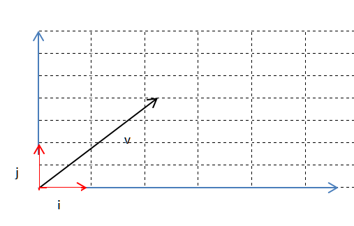
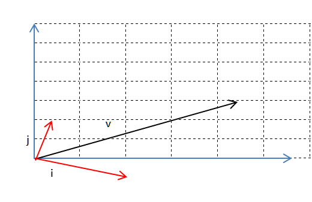

# 线性代数 马尔科夫矩阵 矩阵的特征值和特征向量

[TOC]

资料来源参考连接：
[如何理解矩阵特征值和特征向量](http://www.matongxue.com/madocs/228.html#/madoc)
[行列式的本质是什么](http://www.matongxue.com/madocs/247.html#/madoc)
[相似矩阵是什么](https://www.zhihu.com/question/20501504/answer/174887899)

## 引子

问题（该问题来源于[麻省理工公开课：线性代数 24课 马尔科夫矩阵和傅里叶级数](http://open.163.com/movie/2010/11/A/V/M6V0BQC4M_M6V2AVOAV.html)）：假设有两个州分别为加利福尼亚和麻省，加州每过1个单位的时间会有10%的人从加州移居到麻省，有90%的人继续留在加州，麻省有%20的人移居到加州，仅有80%的人依然留在麻省。假设最开始麻省有1000人加州0人，问经过无限长的时间后两个州剩下的人数？

### 思路

这个问题实际上问的是矩阵幂运算过程中的稳态，
$$$
已知变换矩阵为A那么k段时间后两周的人数组成的向量为u_k=Au_o，\\
其中u_o就是初始人数向量，根据题述为
\left[
\begin{matrix}
	0\\
    1000
\end{matrix}
\right]
，\\
而A就是用于变换的马尔科夫矩阵，根据题设为
\left[
\begin{matrix}
	0.9&0.2\\
    0.1&0.8
\end{matrix}
\right]
$$$
因此，无限时间后两州剩下的人数就可以看作是$$$lim_{k->\infty}u_k$$$

下面详细说明为什么，这个题目要这样做。

## 左乘方阵的本质

要解开开头的问题，我们首先需要明白向量左乘矩阵的本质：

向量左乘方阵，实际上可以看作是对向量施加一个运动，亦或是一个线性变换。因此，线性方程
$$$
Ax=b中，若A为方阵
$$$
则可以理解为将**向量 x 进行线性变换 A 得到向量 b**。

##### 线性变换

线性变换在几何上就是包含对一条线段进行推移和旋转运动的一种变换，它有三个性质：
1. 变换前是直线，变换后依然是直线
2. 直线的比例保持不变
3. 变换前是原点，变换后依然是原点

线性变换的本质是对该n维空间上的基向量的拉伸和旋转，设二维空间中有基向量$$$i,j,那么对由i,j 线性组合而成的向量进行线型变换就是对i,j进行拉伸和旋转，\\
并以变换后的基向量作为原向量的基，如图:$$$

线性变换前

线性变换（拉伸旋转）后：

假设我们有一个旋转矩阵$$$T=\left[\begin{matrix}cosθ&-sinθ\\sinθ&cosθ\end{matrix}\right]$$$，那么通过左乘这个旋转矩阵，就可以实现一个向量在二维平面上的旋转。

同理，若是左乘一个对角方阵，则可视为向量通过该矩阵实现了拉伸。

## 特征向量和特征值

设有矩阵A，则在线性方程
$$$
Ax=λx
$$$
中，λ就是A的特征值，x就是A的特征向量。

### 意义

在理解矩阵实际上可视为一种运动之后，就比较好理解特征值和特征向量对于矩阵的意义，狭义上，我们可以认为，**特征向量就**是运动的**方向**，**特征值**就是运动的**速度**。

假设在空间中有一个向量v，那么 A·v 就可以视为v经过A变换之后形成的新向量，如果，这个经过变换之后的向量 v' 的方向与v相同，那么就可以得到线性方程 Av=λv，所以在对v进行A变换实际上就是在让v以λ速度往v方向进行变换。

当然广义上特征向量与特征值肯定不只是指方向和速度，它还有更多的含义。

### 计算

要计算一个矩阵的特征值和特征向量，我们可以从他的方程入手：
$$$
\because Ax=λx\\
\therefore (A-λI)x=0\\
因为对于线性方程 Bx=0，若x有非零解，那么B中的各列必定线性相关，则矩阵B不可逆，为奇异矩阵\\
由奇异矩阵的性质得奇异矩阵的行列式 det(B)=0\\
\therefore det(A-λI)=0\\
由此解得λ，再回代，通过消元解得x
$$$

### 性质

特征值可能为实数也可能为复数，有时候也会不存在。

矩阵**特征值的和**为其**对角线上元素的和**（迹）

矩阵**特征值的积**为其**行列式的值**

## 马尔科夫矩阵

若一个系统的某些因素第n次的变换的结果仅受它的第n-1个结果影响，那么这些因素的变换就可以由马尔科夫矩阵来修饰。

### 性质

假设有一个马尔科夫矩阵：
$$$
\left[
\begin{matrix}
	0.9&0.2\\
	0.1&0.8
\end{matrix}
\right]
$$$
1. 那么我们可以发现，它的**每一列元素之和为1**，即0.9+0.1=1，0.2+0.8=1，表示受变换向量中的元素的总值不变。
2. 它的**元素全部为非负数**，因为马尔科夫矩阵与概率有关，而概率是非负的。

上面两个是马尔科夫矩阵的性质，由幂运算达到稳态需要矩阵特征值为1，我们可以得到推论：
1. 马尔科夫矩阵有**一个特征值为1**
2. 它的其它特征值的绝对值小于1

一个特征值为1很容易证明，只需要用
$$$
A-I，因为它的列项之和为1，那么每一列减去一个1，列项之和就自然变成了0，\\
列项之和为0意味着它的各行之间线性相关，即(A-I)^T
\left[
\begin{matrix}
	1\\
    1\\
    ...\\
    1
\end{matrix}
\right]=0，\\
$$$
$$$
又因为A-I是方阵，所以A-I的列向量也线性相关，即有非零解x使得(A-I)x=0
$$$

### 稳态

接下计算$$$u_o经过马尔科夫矩阵运算达到的稳态u_k$$$
$$$
u_k=A^ku_o=P\bigwedge^kP^{-1}u_o=P\bigwedge^kP^{-1}Pc\\
（Pc为线性无关的n个（全部）特征向量组合的矩阵[x_1,x_2...x_n]与常数向量
\left[
\begin{matrix}
	c_1\\
    c_2\\
    ...\\
    c_n
\end{matrix}
\right]
的积，写作Pc，\\
$$$
$$$
也可记为u_o=c_1x_1+c_2x_2+...+c_nx_n=Pc)\\
$$$
$$$
所以u_k=P\bigwedge^kc=c_1λ_1^kx_1+c_2λ_2^kx_2+...+c_nλ_n^kx_n
$$$
$$$
所以，当λ_1为1的时候，其它的λ小于1会使得当k趋向于无穷大的时候，u_k=c_1x_1\\
也就是说，稳态u_k=c_1x_1
$$$

### 应用

那么看回开头的题目，由于题目中的马尔科夫方阵只有二维，那么它的另一个特征值
$$$
λ_2=0.9+0.8-λ_1=1.7-1=0.7
$$$
然后求特征向量：
$$$
\because (A-I)x_1=0 \therefore x_1=\left[
\begin{matrix}
	2\\
    1
\end{matrix}
\right]\\
所以lim_{k->\infty}u_k=c_1·
\left[
\begin{matrix}
	2\\
    1
\end{matrix}
\right]=
\left[
\begin{matrix}
	2c_1\\
    c_1
\end{matrix}
\right]\\
$$$
$$$
又因为人口总数1000=2c_1+c_1，所以c_1=\frac{1000}{3}，解得u_{\infty}=
\left[
\begin{matrix}
	\frac{2000}{3}\\
    \frac{1000}{3}
\end{matrix}
\right]
$$$
$$$
若要求某一步的结果，例如u_{100}或者u_{50}，那么我们还需要算出特征向量x_2，\\
根据u_k=c_1λ_1^kx_1+c_2λ_2^kx_2+...+c_nλ_n^kx_n，\\
得到此处u_k=c_1λ_1^kx_1+c_2λ_2^kx_2，从而得到u_k
$$$