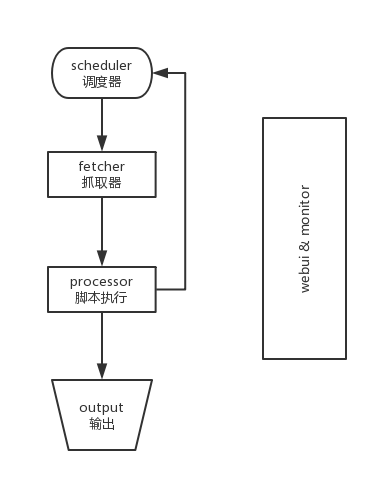

# Pyspider
* [简介](简介)
* [pyspider脚本](pyspider脚本)
* [运行](运行)
* [删除项目](删除项目)
* [实例](实例)

## 简介

[pyspider](https://github.com/binux/pyspider)是Binux做的一个爬虫架构的开源化实现，主要功能有 ：
 - 抓取、更新调度多站点的特定的页面
 - 需要对页面进行结构化信息提取
 - 灵活可扩展，稳定可监控

pyspider以**去重调度，队列抓取，异常处理，监控等功能作为框架**，**只需提供给抓取脚本**，并保证灵活性。最后加上**web的编辑调试环境，以及web任务监控**，即成为了这套框架
pyspider的设计基础是：**以python脚本驱动的抓取环模型爬虫**



 - 各个组件间使用**消息队列连接**，除了**scheduler是单点的**，**fetcher 和 processor 都是可以多实例分布式部署的**。 scheduler 负责整体的调度控制
 - **任务由 scheduler 发起调度，fetcher 抓取网页内容， processor 执行预先编写的python脚本，输出结果或产生新的提链任务（发往 scheduler），形成闭环**
 - 每个脚本可以灵活使用各种python库对页面进行解析，**使用框架API控制下一步抓取动作，通过设置回调控制解析动作**

## pyspider脚本
- ### 初始默认代码

	- 创建一个新的项目后，脚本会自动生成默认代码


```python
#!/usr/bin/env python
# -*- encoding: utf-8 -*-
# Created on 2017-07-06 15:59:37
# Project: music

from pyspider.libs.base_handler import *


class Handler(BaseHandler):
    crawl_config = {
    }

    @every(minutes=24 * 60)
    def on_start(self):
        self.crawl('http://music.163.com/#/discover/toplist?id=2884035', callback=self.index_page，method ='post')

    @config(age=10 * 24 * 60 * 60)
    def index_page(self, response):
        for each in response.doc('a[href^="http"]').items():
            self.crawl(each.attr.href, callback=self.detail_page)

    @config(priority=2)
    def detail_page(self, response):
        return {
            "url": response.url,
            "title": response.doc('title').text(),
        }
```

- ### crawl\_config
	- 设置基本参数，例如


```python
crawl_config = {'headers':{
	'Host': 'www.acfun.cn',
	'User-Agent': 'Mozilla/5.0 (Macintosh; Intel Mac OS X 10.12; rv:54.0) Gecko/20100101 Firefox/54.0',
	'Accept': 'text/html,application/xhtml+xml,application/xml;q=0.9,*/*;q=0.8',
	'Accept-Language': 'zh-CN,zh;q=0.8,en-US;q=0.5,en;q=0.3',
	'Accept-Encoding': 'gzip, deflate',
	'Connection': 'keep-alive',
	'Upgrade-Insecure-Requests': '1',
	'Cache-Control': 'max-age=0'
   }
}
```


- ### on\_start(self)
	- 程序入口，点击**run**会首先运行这个函数


- ### crawl

	- **crawl** 有着相同的功能 **requests** ，可以支持 **get**(默认) 和 **post**，

	- **data** 是想要 **post** 的数据

	- **callback** 可以在执行完 **crawl** 后调用回调函数

	- **method**是指定 访问方法

	- **files** 上传文件，{'key': ('file.name': 'content')}

	- **headers**  请求头，类型dict

	- **cookies** 请求的 Cookies 类型 dict

	- **timeout**  请求内容里最大等待秒数．默认值：120

	- **connect\_timeout** ： 指定请求时链接超时时间,单位秒，默认值：20

	- **proxy** ： 可以设置代理服务器，暂时只支持http代理

	- **fetch\_type** ： 设置是否启用JavaScript解析引擎. 默认值: None

	- **js\_script** ： 可以输入JavaScript语句在页面上执行一段脚本

		更多参数使用可以查看[官方文档](http://docs.pyspider.org/en/latest/)或者[中文文档](http://www.pyspider.cn/book/pyspider/self.crawl-16.html) 档

	```python
	self.crawl(url,method = "POST",data = {},callback = self.function)
	```


- ### response

	- **crawl** 返回的对象是 **response** 对象
	- **Response.url** ： 返回最后的URL地址
	- **Response.text** ： 请求响应的文本格式内容**(如果Response.encoding 是 None 或 chardet 模块可用, 响应内容会自动被解析为指定的编码)**
	- **Response.doc ： 本方法会调用PyQuery库用返回的内容生成一个PyQuery对象以方便使用，生成对象时默认已经把里面的所有链接格式化成绝对链接，可直接分析使用(具体使用对象方法可以参考[PyQuery官方参考手册](https://pythonhosted.org/pyquery/))**
	- **Response.json** ： 本方法会调用JSON相关库来解析返回的内容
	- **Response.status_code** ： 返回响应的状态码
	- **Response.headers** ： 请求响应的头信息，dict格式
	- **Response.cookies** ： 响应的cookies
	- **Response.time** ： 抓取使用的时间


- ### index\_page(self, response)
	- 一般用于抓取url


- ### detail\_page(self, response)

	- 返回一个 **dict** 对象作为结果，结果会自动保存到默认的 **resultdb** 中
	- 如果想输出到数据库，自己再写一个输出函数就好


- ### @every(minutes=24 * 60)
	- 设置多久执行一次（24\*60为一天一次，因此可以每天都爬一次获取数据）


- ### @config
	- **age** 设置任务的有效期限，在这个期限内目标爬取的网页被认为不会进行修改，以秒为单位
	- **priority** 设定任务优先级
	- **auto\_recrawl**  设置是否每到age时间重新爬取一次，默认值是：False
	- **priority**  这个参数用来指定任务的优先级，数值越大越先被执行，默认值为 0
	- **retries**  任务执行失败后重试次数，默认值是 3
	- **itag**  任务标记值，此标记会在抓取时对比，如果这个值发生改变，不管有效期有没有到都会重新抓取新内容．多数用来动态判断内容是否修改或强制重爬，默认值是 None


- ## 输出到数据库


	- 要将结果输出到数据库里，需要先写**数据库的接口类，并在代码中导入**，**还要重写on\_result的方法来调用接口类**
	- 对应数据库接口类和on\_result函数，可以网上搜索也可以自己编写简单的接口类
	- **注意在修改文件后需要重启pyspider才能生效**

<br>

- - -


- ## 运行

	- 写好脚本后设置状态为 **running** 点击 **run** 即可运行
	- rate 用于控制每秒抓取页面的个数，burst 可以视为并发控制。


- ## 删除项目

	- 修改**group** 为 **delete** 状态修改为 **STOP** 24 小时候自动删除


- ## 实例

	- 随手写的实例

```python
#!/usr/bin/env python
# -*- encoding: utf-8 -*-
# Created on 2017-07-06 16:05:23
# Project: ACFun

from pyspider.libs.base_handler import *
import re

class Handler(BaseHandler):
    crawl_config = {'headers':{'Host': 'www.acfun.cn',
                               'User-Agent': 'Mozilla/5.0 (Macintosh; Intel Mac OS X 10.12; rv:54.0) Gecko/20100101 Firefox/54.0',
                               'Accept': 'text/html,application/xhtml+xml,application/xml;q=0.9,*/*;q=0.8',
                               'Accept-Language': 'zh-CN,zh;q=0.8,en-US;q=0.5,en;q=0.3',
                               'Accept-Encoding': 'gzip, deflate',
                               'Connection': 'keep-alive',
                               'Upgrade-Insecure-Requests': '1',
                               'Cache-Control': 'max-age=0'
    }
    }


# 该网站存在异步加载
    #@every(minutes=24*60)
    def on_start(self):
    	self.crawl('http://www.acfun.cn/member/special/getSpecialContentPageBySpecial.aspx', callback=self.index_page,method = 'POST',data = {
            'specialId':"5004873",
            'pageNo':	"1",
            'pageSize'	:"18"
        })

# 获取整体
    def json_parser_url(self, response):
        main_info = [{
            "totalPage": response.json['Page']['totalPage'],
            'pageNo': response.json['Page']['pageNo']
           }]

        info = []
        current_page = main_info['pageNo']
        total_page = main_info["totalPage"]
        while(current_page <= total_page):
            self.crawl('http://www.acfun.cn/member/special/getSpecialContentPageBySpecial.aspx', callback=self.index_page,method = 'POST',data = {
            'specialId':"5004873",
            'pageNo':str(current_page),
            'pageSize':"18"
        })
            current_page = current_page + 1


	@config(age=10 * 24 * 60 * 60)
    def index_page(self, response):
        pre_url = 'http://www.acfun.cn/a/'
        json = response.json['specialContents']
        for x in range(len(json)):
            title = "".join(re.findall('[\u4e00-\u9fa5].*?',json[x]["contentTitle"]))
            url = pre_url + "".join(re.findall('[]a-zA-Z[0-9]{2,32}',json[x]['url']))
            print(title,url)
            self.crawl(url,callback = self.detail_page)

	@config(priority=2)
    def detail_page(self, response):
        url = []
        for x in response.doc('p[style="text-align: center"]').items():
            if "".join(re.findall(".*?.jpg",str(x.children().attr('src')))) != "":
                url.append("".join(re.findall(".*?.jpg",str(x.children().attr('src')))))


        title = response.doc('span[class="txt-title-view_1"]').text()
        info =  {
            "url": url,
            "title": title
        }
        self.output(info)

   def output(self,info):
        fp = open('/Users/Chok-John/Desktop/text.txt','a+')
        fp.write('\n')
        fp.write(str(info['title'] + "\n"))
        fp.write("\n".join(info['url']))
        fp.close()


```