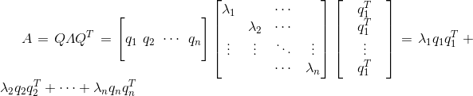

# 马尔可夫矩阵
- 各元素为非负值
- 每一列元素和为1
- 他必有一个特征值为1,其他特征值的绝对值小于1
- 马尔可夫矩阵的幂仍是马尔可夫矩阵
- 由上可知,特征值的绝对值小于1的项最终都趋近于0，稳态取决于特征值为1:

$$

\\u_k = A^ku_0 = c_1\lambda_1^kx_1 + c_2\lambda_2^kx_2 + ... + c_k\lambda_k^kx_k
$$

- $$$det(A-\lambda I) = 0,马尔可夫矩阵减去一个单位阵,列向量中元素和为0
，\\则矩阵的任意行都可以用“零减去其他行之和”表示出来，即该矩阵的行向量线性相关。$$$

- 矩阵转置不改变特征值

- 接下来介绍马尔科夫矩阵的应用，我们用麻省和加州这两个州的人口迁移为例：元素非负，列和为一。这个式子表示每年有10的人口从加州迁往麻省，同时有的人口从麻省迁往加州。注意使用马尔科夫矩阵的前提条件是随着时间的推移，矩阵始终不变。设初始情况为

$$
	u_0=\left[ \begin{matrix}
	u_{cal}\\
	u_{mass}
	\end{matrix} \right]_0 =\left[\begin{matrix}
	0\\
	1000
	\end{matrix} \right]_0 \\
	A = \left[\begin{matrix}
	0.9&0.2\\
	0.1&0.8
	\end{matrix} \right]\\
	u_k=A^ku_o
$$

$$$ 计算特征值：我们知道马尔科夫矩阵的一个特征值为λ_1=1,那么另一个特征值为λ_2=0.7\\
计算特征向量:即求 A-\lambda I = 0的零空间,解得x_1 = \left[\begin{matrix}2\\1\end{matrix} \right],x_2 = \left[\begin{matrix}-1\\ 1\end{matrix} \right]\\
稳态值u_{\infty} = c_1\left[\begin{matrix}2\\1\end{matrix} \right],c_1 = \frac{1000}{3}\\由u_0= \left[\begin{matrix}0\\1000\end{matrix} \right] = c_1\left[\begin{matrix}2\\1\end{matrix} \right]+c_2\left[\begin{matrix}-1\\1\end{matrix} \right]解得c_1 = \frac{1000}{3},c_2 = \frac{2000}{3}
$$$ $$$

# 傅里叶级数
$$
设n_1 + n_2 + ...n_n为n维空间的正交基,那么对所有维数小于等于n的向量,可以表示为正交基的线性组合\\V = x_1q_1 +  x_2q_2 +...+ x_nq_n$$

-  因此该向量的列之间的内积为0
-  想获得哪一项则有对应的基乘以该向量即:
$$
	q_1^Tv = x_1q_1^Tq_1,写出矩阵形式得Qx=v,自然x = Q^{-1}v`
$$

- $$$f(x)=a_0+a_1cosx+b_1sinx+a_2cos2x+b_2sin2x+⋯$$$
- 他们的基正交故傅里叶级数成立,函数的内积为 $$$f^Tg = \int _0^{2\pi}f(x)g(x)dx$$$

- $$$a_0是f(x)的平均值$$$

# 矩阵的对角化
- 矩阵可以对角化的前提是有n个线性无关的特征向量

$$$
有矩阵A,它的特征向量为x_1,x_2,⋯,x_n,使用特征向量作为列向量组成一个矩阵,即特征向量矩阵\\S=
\left[ \begin{matrix}
	x_1&x_2&⋯&x_n
	\end{matrix} \right],然后求出S的逆矩阵S^{-1},把特征值按特征向量在特征矩阵的顺序写在矩阵Λ的对角线上(该矩阵除对角线元素都为0),然后就可以将矩阵A表示为 A = SΛS^{-1},这就是矩阵的对角化.
$$$

- 然后称Λ为A的相似标准型
- $$$称A = SΛS^{-1}A的相似标准型分解$$$
- 应用:可简化矩阵的幂运算,$$$A^k = SΛ^kS^{-1},由于Λ为对角阵,幂运算就比较好算$$$

# 对称矩阵
- 对称矩阵特征值为实数
- $$$满足	A = A^T为对称矩阵$$$
- 对称矩阵的特征向量正交,把特征向量都化为单位向量,那么$$$A = QΛQ^{-1} =  QΛQ^{-T}$$$该分解本身代表着对称,在数学上叫做谱定理（spectral theorem），谱就是指矩阵特征值的集合。

- 注意这个展开式中的$$$qq^T$$$，因为$$$q$$$是单位列向量所以$$$qTq=1$$$，结合之前投影所讲的$$$\frac{qqT}{qTq} = qqT$$$是一个投影矩阵
实际上每一个对称矩阵都可以分解为一系列相互正交的投影矩阵

#### 正主元的个数等于正特征值的个数

# 正定矩阵
- 正定矩阵就是**在对称矩阵**的基础上，还有三大性质：
	- 所有主元为正数
	- 所有特征值为正
	- 子行列式为正(从左上角开始的主子矩阵)

- 半正定矩阵就是特征值为非负数的对称矩阵
- 判断正定矩阵的方法：

- 矩阵的所有特征值大于零则矩阵正定：$λ_1>0, λ_2>0$
- 矩阵的所有顺序主子阵的行列式大于零则矩阵正定：$a>0, ac−b^2>0a>0, ac−b^2>0$
- 矩阵消元后主元均大于零：$矩阵二阶时,第二个主元为\frac{ac−b^2}{a},第n个主元的值 = \frac{det(n)}{det(n-1}$

- $x^TAx >0$
- 一般情况下第四条是正定矩阵的定义，而前三条可以验证正定矩阵

- 当det A = 0 时,称为半正定矩阵

- 有极小值的条件是其二阶导数矩阵为正定矩阵

- 正定矩阵的几何意义就是一个椭球，在2阶时是个椭圆，3阶时就是个椭球体，特征向量说明了主轴的方向，特征量说明了主轴的长度.

# 线性变换
- 判断一个操作是否为线性变换,可以验证该操作是否满足一下要求

$$
T(v+w) = T(v) + T(w) \\\\
T(cv) = cT(v) \\\\
结合起来就是\quad T(cv+dw)=cT(v)+dT(w)
$$

- 显然平移不是线性变化,若一向量进行平移,即加上向量$v_0$,若此时该向量和平移向量$v_0$伸长为原来的两倍,那么平移的结果就会改变(实际上$v_0$不用伸长),故平移不是线性变换.

- 投影也是线性变换

- 旋转是线性变化

- 求导运算其实是线性变换，因此我们只要知道少量函数的求导法则$(如\sin x,\cos x,e^x)$，就能求出它们的线性组合的导数。

- 若$v_1,v_2...v_n$是输入空间一组基,又知道$T(v_1),T(v_2)...T(v_n)$是输出空间的一组基,那么输入空间的所有向量$v$,都可以通过线性变换到输出空间,原因是$v能表示为v_1,v_2...v_n$的线性组合,而在输出空间也有与$v_1,v_2...v_n$对应的基$T(v_1),T(v_2)...T(v_n)$

- 矩阵的逆相当于对应线性变换的逆运算，矩阵的乘积相当于线性变换的乘积，实际上矩阵乘法也源于线性变换。

# 
